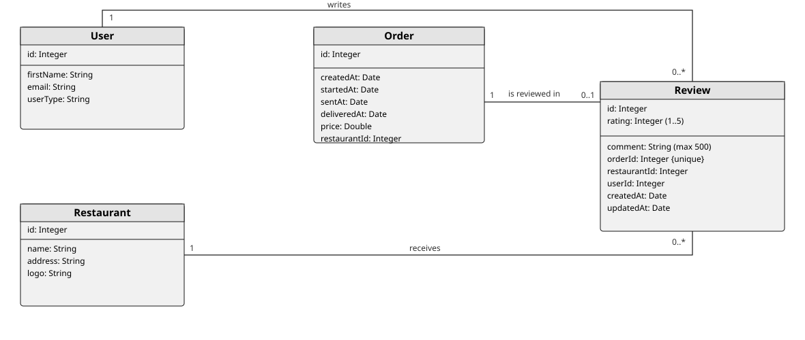

# Examen DeliverUS - Modelo Reseñas - Valoración de Pedidos por Clientes

## Enunciado del examen

Hasta ahora DeliverUS contaba con dos tipos de usuario: **customer** (cliente, que realiza pedidos) y **owner** (propietario, que gestiona sus restaurantes y confirma/envía/entrega los pedidos). En esta convocatoria se incorpora a la aplicación de cliente (`DeliverUS-Frontend-Customer`) la **gestión de reseñas y valoraciones**: una vez recibido un pedido, el cliente puede valorar el restaurante con una puntuación y un comentario.

### ¿Qué es una reseña y qué puede hacer el customer?

Una reseña es la valoración que un cliente hace de un restaurante a partir de un pedido que ya ha recibido. Cada reseña tiene una **puntuación** (de 1 a 5 estrellas) y un **comentario** opcional. Una reseña siempre nace de un pedido entregado, por lo que queda ligada al pedido, al restaurante y al cliente que la escribió, y un mismo pedido solo puede valorarse una vez.

De forma resumida, un customer puede:

1. **Registrarse e identificarse** (`POST /users/register`, `POST /users/login`). *Esta parte ya está implementada.*
2. **Consultar sus reseñas**, para repasar las valoraciones que ha escrito. *Esta parte ya está implementada.*
3. **Consultar sus pedidos**, para localizar los que ya ha recibido y saber si ya los ha valorado.
4. **Crear una reseña** sobre un pedido que ya ha sido entregado, indicando una puntuación de 1 a 5 y, opcionalmente, un comentario.
5. **Editar una reseña** propia, corrigiendo la puntuación o el comentario.
6. **Eliminar una reseña** propia, de forma que el pedido vuelve a quedar sin valorar.

> ⚠️ **Solo se puede reseñar un pedido entregado** (`deliveredAt` establecido) y **cada pedido admite una única reseña**. Una reseña solo puede editarse o eliminarse por el cliente que la escribió.

### Modelado conceptual

Diagrama de clases de referencia de DeliverUS incluyendo la entidad `Review` y sus relaciones con `Order`, `Restaurant` y `User` (a modelar por el alumnado).



### Modelo de datos de la reseña

| Campo | Tipo | Descripción |
| --- | --- | --- |
| `id` | INTEGER | Clave primaria. |
| `rating` | INTEGER | Puntuación de la reseña, de 1 a 5. |
| `comment` | STRING | Comentario opcional (máximo 500 caracteres). |
| `orderId` | INTEGER | Clave foránea al pedido valorado (única: un pedido, una reseña). |
| `restaurantId` | INTEGER | Clave foránea al restaurante valorado (se deduce del pedido). |
| `userId` | INTEGER | Clave foránea al customer autor de la reseña. |
| `createdAt` | DATE | Fecha de creación de la reseña. |
| `updatedAt` | DATE | Fecha de la última modificación de la reseña. |

### La reseña en el ciclo de vida del pedido

El ciclo de vida del pedido sigue siendo `pending → confirmado (startedAt) → enviado (sentAt) → entregado (deliveredAt)`, gestionado por el owner mediante `confirm`/`send`/`deliver`. La reseña se crea **solo** cuando el pedido está `entregado` (con `deliveredAt` establecido). Mientras un pedido no esté entregado no se puede reseñar, y si ya tiene una reseña no se puede crear otra.

Es necesaria la implementación de los siguientes requisitos funcionales:

> Las pruebas de aceptación de cada RF se dividen en **Backend** (que se ayudan a verificar con `reviews.test.js`, que no debe modificarse) y **Frontend** (comportamiento que debe observarse al usar la aplicación: navegación tras una acción y mensajes de éxito/error).

### **RF1. Consultar mis reseñas**. **YA IMPLEMENTADO**

**Como** customer,

**quiero** ver el listado de las reseñas que he escrito

**para** repasar mis valoraciones.

**Pruebas de aceptación — Backend** (`GET /reviews/customer`):

- Sin sesión iniciada: `401 Unauthorized`.
- Con sesión iniciada como `owner`: `403 Forbidden`.
- Con sesión iniciada como `customer`: `200 OK` y un array de reseñas.
- El listado solo debe incluir reseñas cuyo `userId` sea el del customer autenticado (nunca reseñas de otros clientes).
- Las reseñas deben listarse de la más reciente a la más antigua.
- Cada reseña debe incluir los datos resumidos del restaurante (`id`, `name`, `logo`) y su `orderId`.

**Pruebas de aceptación — Frontend** (`MyReviewsScreen.js`, ya implementada, para referencia):

- Al entrar en la pestaña "My reviews" se carga el listado automáticamente.
- Si la petición falla, se muestra un mensaje de error y se conserva el listado previo.

### **RF2. Crear una reseña**

**Como** customer,

**quiero** valorar con una puntuación y un comentario un pedido que ya he recibido

**para** dejar constancia de mi opinión sobre el restaurante.

**Pruebas de aceptación — Backend** (`POST /orders/:orderId/reviews`):

- Sin sesión iniciada: `401 Unauthorized`.
- Con sesión iniciada como `owner`: `403 Forbidden`.
- Pedido que no pertenece al customer autenticado: `403 Forbidden`.
- Pedido inexistente: `404 Not Found`.
- `rating` ausente en el cuerpo de la petición: `422 Unprocessable Entity`.
- `rating` no entero o fuera del rango 1-5: `422 Unprocessable Entity`.
- `comment` supera los 500 caracteres: `422 Unprocessable Entity`.
- Pedido que todavía no ha sido entregado (`deliveredAt` es `null`): `409 Conflict`.
- Pedido que ya tiene una reseña: `409 Conflict`.
- Éxito: `201 Created`, con la reseña devuelta incluyendo `rating` y `comment`, `orderId` igual al del pedido, `restaurantId` deducido del pedido y `userId` igual al del customer autenticado.

**Pruebas de aceptación — Frontend** (pantallas "My Orders" y formulario de reseña, **Ejercicios 4 y 5**):

- Un pedido entregado y sin reseña muestra el botón "Write review" (color `brandGreen`).
- Al pulsarlo se navega a la pantalla del formulario de reseña.
- Al guardar con éxito: se muestra un mensaje de éxito y se vuelve al listado "My Orders", donde el pedido ya muestra su reseña.
- Si la creación falla (p. ej. el pedido ya no está entregado o ya tenía reseña): se muestra un mensaje de error y se permanece en el formulario.

### **RF3. Consultar mis pedidos**

**Como** customer,

**quiero** ver el listado de los pedidos que he realizado

**para** localizar los que ya he recibido y saber si ya los he valorado.

**Pruebas de aceptación — Backend** (`GET /orders/customer`):

- Sin sesión iniciada: `401 Unauthorized`.
- Con sesión iniciada como `owner`: `403 Forbidden`.
- Con sesión iniciada como `customer`: `200 OK` y un array de pedidos.
- El listado solo debe incluir pedidos cuyo `userId` sea el del customer autenticado (nunca pedidos de otros clientes).
- Los pedidos pendientes de entregar (`deliveredAt` es `null`) deben listarse antes que los ya entregados (`deliveredAt` establecido).
- Cada pedido debe incluir los datos del restaurante (`id`, `name`, `logo`) y su reseña asociada en la propiedad `review` (o `null` si el pedido todavía no ha sido valorado).

**Pruebas de aceptación — Frontend** (pantalla "My Orders", **Ejercicio 4**):

- Cada pedido se muestra con el logo del restaurante, el id del pedido, el nombre del restaurante, la dirección de entrega y el precio.
- Si el pedido tiene una reseña, se muestra su puntuación (estrellas) y su comentario.
- Si el pedido está entregado y no tiene reseña, se muestra el botón "Write review".
- Si el customer no tiene pedidos, se muestra un mensaje indicándolo en lugar de una lista vacía.
- Si la petición falla, se muestra un mensaje de error.

### **RF4. Editar una reseña**

**Como** customer,

**quiero** editar la puntuación o el comentario de una reseña que he escrito

**para** corregir mi valoración.

**Pruebas de aceptación — Backend** (`PATCH /reviews/:reviewId`):

- Sin sesión iniciada: `401 Unauthorized`.
- Con sesión iniciada como `owner`: `403 Forbidden`.
- Reseña que no pertenece al customer autenticado: `403 Forbidden`.
- Reseña inexistente: `404 Not Found`.
- `rating` presente pero no entero o fuera del rango 1-5: `422 Unprocessable Entity`.
- `comment` supera los 500 caracteres: `422 Unprocessable Entity`.
- Éxito: `200 OK`, con la reseña devuelta reflejando los nuevos valores de `rating` y/o `comment`.

**Pruebas de aceptación — Frontend** (pantalla del formulario de reseña, **Ejercicio 5**):

- Se accede a esta pantalla desde el listado "My Orders" al pulsar "Edit review" sobre un pedido valorado.
- El formulario se inicializa con la puntuación y el comentario ya guardados.
- Si el usuario introduce una puntuación fuera de 1-5 o un comentario de más de 500 caracteres, la aplicación de frontend debe mostrar un error de validación **antes** de enviar la petición. En cualquier caso, la aplicación de backend también debe asegurar estas reglas y mostrar los errores enviados por el backend.
- Al guardar con éxito: se muestra un mensaje de éxito y se navega de vuelta al listado "My Orders".
- Si guardar falla (p. ej. error del servidor o de conexión): se muestra un mensaje de error y se permanece en el formulario, sin perder lo escrito.

### **RF5. Eliminar una reseña**

**Como** customer,

**quiero** eliminar una reseña que he escrito

**para** dejar de valorar un pedido.

**Pruebas de aceptación — Backend** (`DELETE /reviews/:reviewId`):

- Sin sesión iniciada: `401 Unauthorized`.
- Con sesión iniciada como `owner`: `403 Forbidden`.
- Reseña que no pertenece al customer autenticado: `403 Forbidden`.
- Reseña inexistente: `404 Not Found`.
- Éxito: `200 OK`, y la reseña deja de aparecer en `GET /reviews/customer` y el pedido vuelve a mostrarse sin reseña en `GET /orders/customer`.

**Pruebas de aceptación — Frontend** (pantalla "My Orders", **Ejercicio 4**):

- Un pedido valorado muestra el botón "Delete review" (color `brandGreen`).
- Al pulsarlo con éxito: se muestra un mensaje de éxito y se refresca el listado **en la misma pantalla**; el pedido actualizado deja de mostrar la reseña y el botón pasa a ser "Write review".
- Si la acción falla: se muestra un mensaje de error y el listado no se modifica.

---

## Parte Backend

### Ejercicios (Backend)

#### 1. Migraciones y Modelos (1 punto)

Se le entrega el modelo `Review` (`src/models/Review.js`), su migración `create-review` y su seeder. El modelo ya define las asociaciones `Review.belongsTo(Order)` (alias `order`), `Review.belongsTo(Restaurant)` (alias `restaurant`) y `Review.belongsTo(User)` (alias `user`). Complete el modelado añadiendo las asociaciones inversas:

- `Order.hasOne(Review)` con alias `review`.
- `Restaurant.hasMany(Review)` con alias `reviews`.
- `User.hasMany(Review)` con alias `reviews`.

Recuerde registrar estas asociaciones en los métodos `associate` de `Order.js`, `Restaurant.js` y `User.js`, usando las claves foráneas ya presentes en la migración (`orderId`, `restaurantId` y `userId`).

#### 2. Enrutamiento, Middlewares y Validación (2 puntos)

Añada las rutas necesarias para implementar los siguientes requisitos funcionales:

- En `src/routes/OrderRoutes.js`, la ruta **RF2. Crear una reseña** (`POST /orders/:orderId/reviews`).
- En `src/routes/ReviewRoutes.js` (ya contiene `GET /reviews/customer` como parte del **RF1**), las rutas:
  - **RF4. Editar una reseña** (`PATCH /reviews/:reviewId`)
  - **RF5. Eliminar una reseña** (`DELETE /reviews/:reviewId`)

En `src/middlewares/ReviewMiddleware.js` (fichero nuevo), implemente los siguientes middlewares:

- `checkOrderCanBeReviewed` para cumplir el **RF2** (el pedido está entregado y todavía no tiene reseña).
- `checkReviewOwnership` para comprobar que la reseña pertenece al customer autenticado (usado en **RF4** y **RF5**).

En `src/controllers/validation/ReviewValidation.js` (fichero nuevo), añada las reglas de validación:

- `create` necesarias para cumplir **RF2** (`rating` obligatorio, entero entre 1 y 5; `comment` opcional, máximo 500 caracteres).
- `update` necesarias para cumplir **RF4** (`rating` opcional, entero entre 1 y 5; `comment` opcional, máximo 500 caracteres).

> El middleware `checkOrderBelongsToCustomer`, `checkOrderVisible`, `checkEntityExists` y `handleValidation` ya están implementados y puede tomarlos como referencia en caso necesario.

> Como referencia de orden de rutas, `POST /orders/:orderId/reviews` pasa por: `isLoggedIn`, `hasRole('customer')`, `checkEntityExists(Order, 'orderId')`, `checkOrderBelongsToCustomer`, las reglas de validación `create`, `handleValidation`, `checkOrderCanBeReviewed` y, por último, el controlador.

#### 3. Controladores (2 puntos)

En `src/controllers/ReviewController.js`:

- Implemente `create` para cumplir con **RF2. Crear una reseña** (deduzca `restaurantId` y `userId` a partir del pedido y del customer autenticado, no del cuerpo de la petición).
- Implemente `update` para cumplir con **RF4. Editar una reseña**.
- Implemente `destroy` para cumplir con **RF5. Eliminar una reseña**.

En `src/controllers/OrderController.js`:

- Implemente `indexCustomer` para cumplir con **RF3. Consultar mis pedidos** (actualmente devuelve `500`), incluyendo el restaurante y la reseña asociada a cada pedido.

> El controlador `ReviewController.indexCustomer` ya está implementado como parte del **RF1. Consultar mis reseñas** y puede tomarlo como referencia.

---

### Código Proporcionado (Backend)

Para este examen, se le entrega ya implementado:

1. Registro y login de clientes (`registerCustomer`/`loginCustomer`, en `UserController.js` y `UserRoutes.js`).
2. El modelo `Review` (`src/models/Review.js`), su migración (`create-review`) y su seeder, incluyendo reseñas de ejemplo para el customer de pruebas.
3. El controlador `ReviewController.indexCustomer` y la ruta `GET /reviews/customer` (**RF1. Consultar mis reseñas**).
4. La comprobación de que un pedido pertenece al customer autenticado (`checkOrderBelongsToCustomer`, en `OrderMiddleware.js`).
5. Los controladores `confirm`, `send`, `deliver` y `show`, que podría reutilizar en caso necesario.
6. El seeder de usuarios ya incluye un customer de pruebas: `customer1@customer.com` / `secret`, con pedidos entregados (uno ya valorado y otro pendiente de valorar).

---

## Parte Frontend (aplicación Customer)

Implemente las pantallas necesarias en `DeliverUS-Frontend-Customer` para que un customer pueda usar la aplicación.
**NOTA: solo se valorará aquello que pueda ser utilizado tal y como lo haría un usuario final. No se valorarán pantallas que no renderizan o funcionalidades que no puedan probarse desde la interfaz**

### Ejercicios (Frontend)

#### 4. Pantalla de listado "My Orders" (2 puntos)

**Pantalla**: `src/screens/customerOrders/MyOrdersScreen.js`

Actualmente esta pantalla es un esqueleto que no muestra ningún pedido. Impleméntela para cumplir con **RF3. Consultar mis pedidos**, **RF2. Crear una reseña**, **RF4. Editar una reseña** y **RF5. Eliminar una reseña**. Use el componente `ImageCard` para cada pedido y puede utilizar `MyReviewsScreen.js` como inspiración.

- Cada pedido se muestra con el logo del restaurante, el id del pedido, el nombre del restaurante, la dirección de entrega y el precio.
- Si el pedido está entregado y **no** tiene reseña, muestra el botón "Write review" (color `brandGreen`), que navega al formulario de reseña (`EditReviewScreen`).
- Si el pedido tiene reseña, muestra su puntuación (estrellas) y su comentario, junto con los botones "Edit review" (navega a `EditReviewScreen`) y "Delete review" (color `brandGreen`).
- Al pulsar "Delete review" con éxito se refresca el listado **en la misma pantalla**; si falla, se muestra un error y el listado no cambia.
- El listado se recarga al volver desde la pantalla `EditReviewScreen`, no solo la primera vez que se monta la pantalla.
- Si el customer no tiene pedidos, se muestra un mensaje indicándolo en lugar de una lista vacía.
- Si la petición falla, se muestra un mensaje de error.

**API Backend necesaria** (añada las funciones que falten en `src/api/OrderEndpoints.js` y `src/api/ReviewEndpoints.js`):

- `GET /orders/customer`
- `DELETE /reviews/:reviewId`

#### 5. Formulario de reseña (2 puntos)

**Pantalla**: `src/screens/customerOrders/EditReviewScreen.js`

Ya dispone de una versión de esta pantalla con una cabecera con datos del restaurante y del pedido, y el listado de productos. Añada un formulario con `Formik` y un esquema de validación de `yup` para cumplir con **RF2. Crear una reseña** y **RF4. Editar una reseña**, mostrando eventuales errores de validación enviados desde backend. La pantalla ya está registrada en `CustomerOrdersStack.js` y es alcanzable desde `MyOrdersScreen`.

- La pantalla se comporta como **creación** si el pedido no tiene reseña, y como **edición** si ya la tiene (inicializando el formulario con la puntuación y el comentario existentes).
- El formulario incluye la puntuación (1-5) y el comentario (máximo 500 caracteres).

**API Backend necesaria** (añada las funciones que falten en `src/api/ReviewEndpoints.js`):

- `POST /orders/:orderId/reviews`
- `PATCH /reviews/:reviewId`

#### Fidelidad estética (1 punto)

Se valorará el grado de similitud visual de las interfaces entregadas con respecto a las pantallas ya existentes de la propia aplicación.

Para ello, tenga también en cuenta lo siguiente:

- Use los colores corporativos definidos en `src/styles/GlobalStyles.js` (`brandBlue`/`brandBlueTap`, `brandGreen`/`brandGreenTap`, `brandPrimary`) y los iconos de `MaterialCommunityIcons` (paquete `@expo/vector-icons`) ya usados en el resto de la aplicación, manteniendo un estilo consistente con las pantallas ya existentes (`MyReviewsScreen.js`, `EditReviewScreen.js`).
- Los iconos concretos de `MaterialCommunityIcons` a utilizar son:

| Icono | Dónde |
| --- | --- |
| `star` | Puntuación de la reseña, en cada tarjeta de pedido (Ejercicio 4) y en el formulario (Ejercicio 5). |
| `star-outline` | Reseña ausente / puntuación vacía (Ejercicio 4). |
| `comment-text` | Botón "Save review" (Ejercicio 5). |
| `map-marker` | Dirección de entrega del pedido, en cada tarjeta de pedido (Ejercicio 4). |
| `cash` | Precio del pedido, en cada tarjeta de pedido (Ejercicio 4). |
| `pencil` | Botón "Edit review" (Ejercicio 4). |
| `delete` | Botón "Delete review" (Ejercicio 4). |

### Código Proporcionado (Frontend Customer)

Para este examen, se le entrega ya implementado:

1. Registro, login y perfil del customer (`LoginScreen.js`, `RegisterScreen.js`, `ProfileScreen.js` y su navegación).
2. La pantalla de mis reseñas (`MyReviewsScreen.js` y su stack `MyReviewsStack.js`), correspondiente al **RF1. Consultar mis reseñas**.
3. La estructura base (cabecera con datos del restaurante y del pedido, y listado de productos) de `EditReviewScreen.js`, a la que solo debe añadir el formulario.
4. El esqueleto de `MyOrdersScreen.js` y la navegación en `CustomerOrdersStack.js`.
5. Las funciones ya existentes en `src/api/OrderEndpoints.js` (`getOrderDetail`) y `src/api/ReviewEndpoints.js` (`getMyReviews`).
6. El componente `InputItem`, ya preparado para integrarse con Formik, y `ImageCard`.

---

## Formato de petición/respuesta

Los códigos de estado y las reglas de negocio de cada endpoint están descritos en la RF correspondiente. Aquí solo se detalla la forma de los datos que no resulte obvia a partir de las RFs.

### POST /orders/:orderId/reviews (RF2)

**Request**:

```json
{
  "rating": 5,
  "comment": "Comida excelente y entrega muy rápida"
}
```

**Respuesta de éxito** (`201 Created`):

```json
{
  "id": 3,
  "rating": 5,
  "comment": "Comida excelente y entrega muy rápida",
  "orderId": 12,
  "restaurantId": 4,
  "userId": 2,
  "createdAt": "2026-09-30T12:00:00.000Z",
  "updatedAt": "2026-09-30T12:00:00.000Z"
}
```

### PATCH /reviews/:reviewId (RF4)

**Request**:

```json
{
  "rating": 4,
  "comment": "Muy bien, aunque tardó un poco"
}
```

---

## Procedimiento de entrega

1. Borrar la carpeta **node_modules** de backend y de ambos frontend.
2. Crear un ZIP que incluya todo el proyecto. **Importante: Comprueba que el ZIP no es el mismo que te has descargado e incluye tu solución**
3. Avisa al profesor antes de entregar.
4. Cuando el profesor te dé el visto bueno, puedes subir el ZIP a la plataforma de Enseñanza Virtual. **Es muy importante esperar a que la plataforma te muestre un enlace al ZIP antes de pulsar el botón de enviar**. Se recomienda descargar ese ZIP para comprobar lo que se ha subido. Un vez realizada la comprobación, puedes enviar el examen.

## Preparación del entorno

### a) Windows

- Abra un terminal y ejecute el comando `npm run install:all:win`.

### b) Linux/MacOS

- Abra un terminal y ejecute el comando `npm run install:all:bash`.

### c) Arranque automático (Linux/MacOS)

- Alternativamente, ejecute `./iniciar.sh` para preparar el entorno y arrancar el backend y la app Customer de una sola vez. El script crea los `.env` que falten, instala dependencias, levanta una base de datos MariaDB en Docker si no hay ninguna accesible, ejecuta migraciones y seeders y arranca los servicios. Use `./iniciar.sh --help` para ver todas las opciones (p. ej. `--all` para la app Owner, `--test` para lanzar los tests e2e, `--setup-only` o `--stop`).

## Ejecución

### 1. Backend

- Para **rehacer las migraciones y seeders**, abra un terminal y ejecute el comando

    ```Bash
    npm run migrate:backend
    ```

- Para **ejecutarlo**, abra un terminal y ejecute el comando

    ```Bash
    npm run start:backend
    ```

### 2. Frontend Customer

- Con el backend en ejecución, abra otro terminal y ejecute el comando

    ```Bash
    npm run start:frontend:customer
    ```

- Puede iniciar sesión con el usuario de pruebas `customer1@customer.com` / `secret`, o registrar un customer nuevo desde la propia aplicación.

## Depuración

- Para **depurar el backend**, asegúrese de que **NO** existe una instancia en ejecución, pulse en el botón `Run and Debug` de la barra lateral, seleccione `Debug Backend` en la lista desplegable, y pulse el botón de *Play*.

## Test

- Como ayuda puede ejecutar el conjunto de tests incluido `reviews.test.js`, que cubre el registro/login de customers, el listado de reseñas propias, la creación, edición, consulta y eliminación de reseñas, y el listado de pedidos propios. Para ello ejecute el siguiente comando:

    ```Bash
    npm run test:backend
    ```

**Advertencia: Los tests no pueden ser modificados.**
