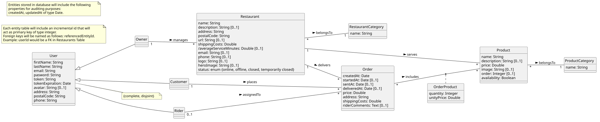
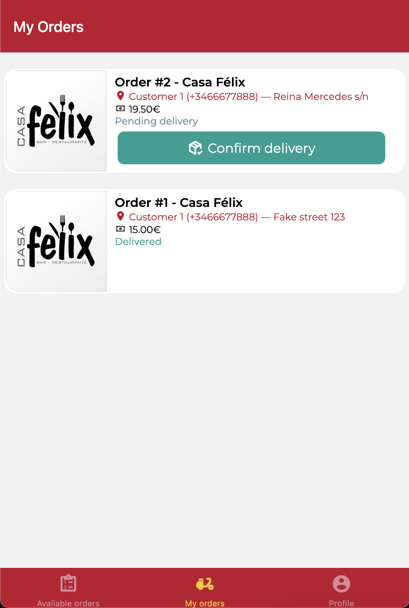
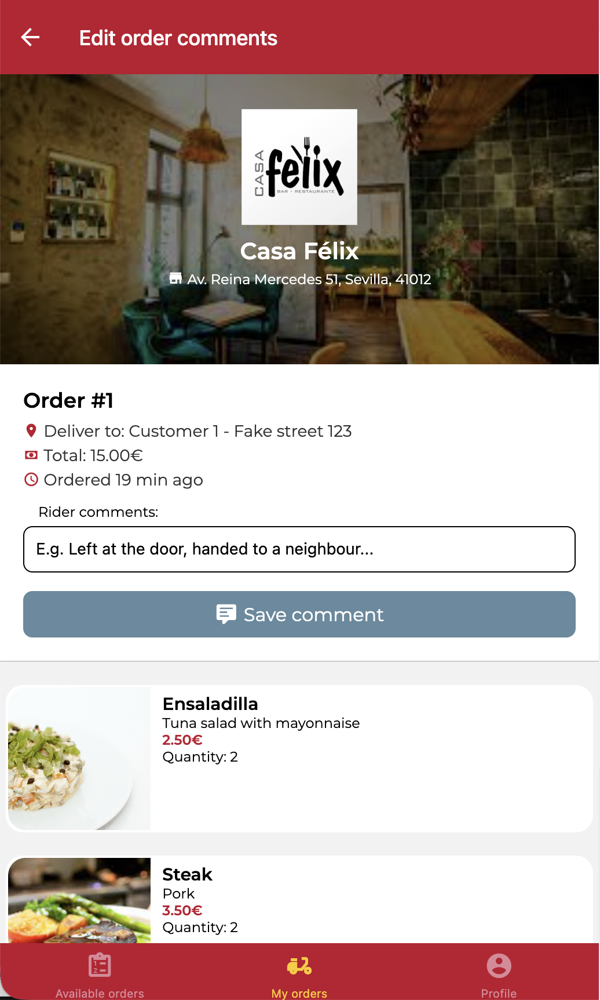

# DeliverUS Exam - Rider Model - Rider Order Management

## Exam Statement

Until now DeliverUS had two user types: **customer** (client, who places orders) and **owner** (restaurant owner, who manages their restaurants and confirms/sends/delivers orders). In this exam a **third user type is added: `rider`** (delivery driver).

### Who is the rider and what can they do?

The rider is the person who picks up orders already confirmed by the owner at the restaurant and delivers them to the customer. It is an independent user type, with its own registration, login, and its own frontend application (`DeliverUS-Frontend-Rider`), just like there are already separate apps for `owner` and `customer`.

In short, a rider can:

1. **Register and login** as a rider (`POST /users/registerRider`, `POST /users/loginRider`). *This part is already implemented.*
2. **View available orders**: those orders that the restaurant has already confirmed (equivalent to no longer being in `pending` state) but that no rider has claimed yet.
3. **Accept and pick up an available order**: the rider decides to take charge of that order, which becomes assigned to them and is marked as picked up (`sentAt` is set). From that moment it stops appearing in the available list for other riders.
4. **Deliver it to the customer**: once on the road, the rider marks the order as delivered.
5. **Add delivery comments**: the rider can write a note about the delivery (e.g. "Left at the door, no answer at the bell").
6. **View their own orders** (the ones assigned to them), to keep track of which ones they still need to deliver and which ones are already completed.

> ⚠️ **Accepting is the only order assignment step.** "Accept" (`accept`) claims the order and sets `sentAt`, moving the order directly to the `Sent` state.

### Conceptual modeling

DeliverUS reference class diagram, including the entities and associations to be worked on in this exam.



### The expanded order lifecycle

You already knew the lifecycle `pending → confirmed (startedAt) → sent (sentAt) → delivered (deliveredAt)`, managed by the owner via `confirm`/`send`/`deliver`. With the addition of the rider, the send and delivery steps of an order can also be carried out by a rider (instead of the owner), following this state diagram:


The following functional requirements need to be implemented:

> The acceptance tests for each FR are split into **Backend** (verified with the help of `riderOrders.test.js`, which must not be modified) and **Frontend** (behavior that must be observed when using the application: navigation after an action and success/error messages).

### **FR1. View available orders**. **ALREADY IMPLEMENTED**

**As** a rider,

**I want** to see the list of already confirmed orders that no rider has claimed yet

**so that** I can choose which one I am going to deliver.

**Acceptance tests — Backend** (`GET /orders/available`):

- Without a session: `401 Unauthorized`.
- With a session as `customer` or `owner`: `403 Forbidden`.
- With a session as `rider`: `200 OK` and an array of orders.
- An order in `pending` state (without `startedAt`, not confirmed by the owner) must not appear in the list.
- A `sent` order — i.e. with `sentAt` set — must not appear in the list either.
- Each returned order must include summarized restaurant data (`name`, `address`, `postalCode`) and customer data (`firstName`).

**Acceptance tests — Frontend** (`AvailableOrdersScreen.js`, already implemented, for reference):

- Entering the "Available orders" tab loads the list automatically.
- If the request fails, an error message is shown and the previous list is kept.

### **FR2. Accept an order**

**As** a rider,

**I want** to claim an available order and mark it as picked up

**so that** I become assigned to it and can start delivering it.

**Acceptance tests — Backend** (`PATCH /orders/:orderId/accept`):

- Without a session: `401 Unauthorized`.
- With a session as `customer` or `owner`: `403 Forbidden`.
- Nonexistent order: `404 Not Found`.
- Order in `pending` state (not confirmed): `409 Conflict`.
- Order already assigned to a rider: `409 Conflict`.
- Success: `200 OK`, and the returned order has `riderId` equal to the authenticated rider's id and `sentAt` set to the acceptance timestamp.

**Acceptance tests — Frontend** (`AvailableOrdersScreen.js`, already implemented, for reference):

- Pressing "Accept order" and receiving a successful response: a success message is shown, the available orders list is refreshed (the accepted order disappears), and navigation switches to the "My orders" tab.
- If acceptance fails (e.g. another rider accepted it first): an error message is shown and the app stays on the available orders screen, without navigating.

### **FR3. View my orders**

**As** a rider,

**I want** to see the list of orders assigned to me

**so that** I can track my pending and completed work, and easily access the orders I need to deliver or comment on.

**Acceptance tests — Backend** (`GET /orders/rider`):

- Without a session: `401 Unauthorized`.
- With a session as `customer` or `owner`: `403 Forbidden`.
- With a session as `rider`: `200 OK` and an array of orders.
- The list must include only orders whose `riderId` is the authenticated rider's (never orders belonging to other riders).
- Orders pending delivery (`deliveredAt` is `null`) must be listed before already delivered ones.

**Acceptance tests — Frontend** ("My Orders" screen, **Exercise 4**):

- Each order is shown with the restaurant logo, the order id, the restaurant name, delivery details (customer, phone, address) and the price.
- Tapping the `ImageCard` of an order navigates to the `EditOrderCommentsScreen`.
- The list is reloaded when returning from the comments screen (`EditOrderCommentsScreen`), not only the first time the screen mounts.
- If the rider has no assigned orders, a message stating so is shown instead of an empty list.
- If the request fails, an error message is shown.

### **FR4. Deliver an order**

**As** a rider,

**I want** to mark an order as delivered to the customer

**so that** it reflects that the delivery has finished.

**Acceptance tests — Backend** (`PATCH /orders/:orderId/riderDeliver`):

- Without a session: `401 Unauthorized`.
- With a session as `customer` or `owner`: `403 Forbidden`.
- Nonexistent order: `404 Not Found`.
- Order assigned to another rider: `403 Forbidden` (the authenticated rider is not the order's `riderId`).
- Order that is not yet in `Sent` state, or already delivered: `409 Conflict`.
- Success: `200 OK`, with `deliveredAt` set to the delivery timestamp.

**Acceptance tests — Frontend** ("My Orders" screen, **Exercise 4**):

- An order that has been accepted but not delivered shows the "Confirm delivery" button (`brandGreen` color).
- Pressing it successfully: a success message is shown and the list is refreshed **on the same screen**; the updated order stops showing any button, since it is now delivered.
- If the action fails: an error message is shown and the list is not modified.

### **FR5. Comment on an order**

**As** a rider,

**I want** to add or edit a note about the delivery of an order assigned to me

**so that** I can record incidents (e.g. where the order was left).

**Acceptance tests — Backend** (`PATCH /orders/:orderId/riderComments`):

- Without a session: `401 Unauthorized`.
- With a session as `customer` or `owner`: `403 Forbidden`.
- Order assigned to another rider: `403 Forbidden`.
- Nonexistent order: `404 Not Found`.
- `riderComments` exceeds 500 characters: `422 Unprocessable Entity`.
- `riderComments` empty, `null` or absent: valid, `200 OK` (the comment is optional).
- Success: `200 OK`, with the returned order reflecting the new `riderComments`.

**Acceptance tests — Frontend** (comments screen, **Exercise 4**):

- This screen is reached by tapping an order's card in the "My Orders" list.
- The form is initialized with the order's already saved comment (or empty if it had none).
- If the user types more than 500 characters, the frontend application must show a validation error **before** sending the request, and the save button must not complete the submission. In any case, the backend application must also ensure the comment does not exceed 500 characters and display errors sent back by the backend.
- On successful save: a success message is shown and navigation returns to the "My Orders" list (`MyOrdersScreen`).
- If saving fails (e.g. server or connection error): an error message is shown and the form stays open, without losing what was typed.

---

## Backend Part

### Exercises (Backend)

#### 1. Migrations and Models (1 point)

Make the necessary changes to migrations and models to implement **FR2. Accept an order** and **FR5. Comment on an order**.

#### 2. Routing, Middlewares and Validation (2 points)

In `src/routes/OrderRoutes.js` add the new routes needed to implement the following functional requirements:

- **FR2. Accept an order**
- **FR3. View my orders**
- **FR4. Deliver an order**
- **FR5. Comment on an order**

In `src/middlewares/OrderMiddleware.js`, implement the following new middlewares:

- `checkOrderCanBeAccepted` to fulfill **FR2. Accept an order**
- `checkOrderCanBeDeliveredByRider` to fulfill **FR4. Deliver an order**
- `checkOrderIsAssignedToRider` to fulfill **FR5. Comment on an order**

In `src/controllers/validation/OrderValidation.js`, add the `updateRiderComments` validation rules needed to fulfill **FR5**.

> The middlewares `checkOrderVisible`, `checkOrderIsPending`, `checkOrderCanBeSent`, `checkOrderCanBeDelivered` and `checkOrderOwnership`, as well as `handleValidation`, are already implemented and you may use them as reference if needed.

> To deliver (`riderDeliver`) an order **you do not need to write a new controller function**: reuse the `deliver` controller function in `OrderController` that the owner already uses for the same state transition, routing it also from the rider's new route.

#### 3. Controllers (2 points)

In `src/controllers/OrderController.js`:

- Implement `accept` to fulfill **FR2. Accept an order**.
- Implement `indexRider` to fulfill **FR3. View my orders**.
- Implement `updateRiderComments` to fulfill **FR5. Comment on an order**.

> To deliver (`riderDeliver`) an order **you do not need to write new controllers**: reuse the `deliver` controller that the owner already uses for the same state transition, routing it also from the rider's new route.

---

### Provided Code (Backend)

For this exam, the following is already provided implemented:

1. Rider registration and login (`registerRider`/`loginRider`, in `UserController.js` and `UserRoutes.js`).
2. The check that a rider can view the detail of any order (`rider` branch of `checkOrderVisible`, in `OrderMiddleware.js`).
3. The `confirm`, `send`, `deliver` and `show` controllers, which you may reuse if needed.
4. The user seeder already includes a test rider: `rider1@rider.com` / `secret`.
5. The `findAvailableOrders` controller function in `OrderController.js`, as part of the implementation of **FR1. View available orders**.

---

## Frontend Part (Rider application)

Implement the screens needed in `DeliverUS-Frontend-Rider` so that a rider can use the application.
**NOTE: only what can be used just as an end user would will be graded. Screens that do not render or functionality that cannot be tested from the interface will not be graded.**

### Exercises (Frontend)

#### 4. "My Orders" list screen (2 points)

<p align="center"></p>

**Screen**: `src/screens/riderOrders/MyOrdersScreen.js`

Implement this screen to fulfill **FR3. View my orders** and **FR4. Deliver an order**. Use the `ImageCard` component for each order. You may use `AvailableOrdersScreen.js` as inspiration.

**Required Backend API** (add the missing functions in `src/api/OrderEndpoints.js`):

- `GET /orders/rider`
- `PATCH /orders/:orderId/riderDeliver`

#### 5. Order comments form (2 points)

<p align="center"></p>

**Screen**: `src/screens/riderOrders/EditOrderCommentsScreen.js`

You are already given a version of this screen showing a header with restaurant and order data, and a list of products. Add a form with `Formik` and a `yup` validation schema, to fulfill **FR5. Comment on an order**, and display any validation errors sent back from the backend. Also register this screen in `MyOrdersStack.js` so it is reachable from `MyOrdersScreen` by tapping on an order.

**Required Backend API** (add the missing function in `src/api/OrderEndpoints.js`):

- `PATCH /orders/:orderId/riderComments`

#### Visual fidelity (1 point)

The degree of visual similarity of the delivered interfaces with respect to the provided screenshots will be evaluated.

For this, also take the following into account:

- Use the corporate colors defined in `src/styles/GlobalStyles.js` (`brandBlue`/`brandBlueTap`, `brandGreen`/`brandGreenTap`, `brandPrimary`) and the `MaterialCommunityIcons` icons (package `@expo/vector-icons`) already used in the rest of the application, keeping a style consistent with the existing screens (`AvailableOrdersScreen.js`, `OrderDetailScreen.js`).
- The specific `MaterialCommunityIcons` icons to use are:

| Icon | Where |
| --- | --- |
| `package-variant-closed-check` | "Confirm delivery" button (Exercise 4). |
| `map-marker` | Customer's delivery address, in each order card (Exercise 4) and in the order header (Exercise 5). |
| `cash` | Order price, in each order card (Exercise 4) and in the order header (Exercise 5). |
| `comment-text` | "Save comment" button (Exercise 5). |

### Provided Code (Rider Frontend)

For this exam, the following is already provided implemented:

1. Rider registration, login and profile (`LoginScreen.js`, `RegisterScreen.js`, `ProfileScreen.js` and their navigation).
2. The available orders screen (`AvailableOrdersScreen.js`), including the button to accept (`acceptOrder`) an order.
3. The functions already existing in `src/api/OrderEndpoints.js`: `getAvailableOrders`, `getOrderDetail`, `acceptOrder`.
4. The base structure (header with restaurant data and product list) of `EditOrderCommentsScreen.js`, to which you only need to add the form.
5. The `InputItem` component, already prepared to integrate with Formik.

---

## Request/response format

The status codes and business rules for each endpoint are described in the corresponding FR. Only the shape of the data that is not obvious from the FRs is detailed here.

### PATCH /orders/:orderId/riderComments (FR5)

**Request**:

```json
{
  "riderComments": "Left at the door, no answer at the bell"
}
```

---

## Submission procedure

1. Delete the **node_modules** folder from the backend and both frontends.
2. Create a ZIP including the whole project. **Important: Check that the ZIP is not the same one you downloaded and that it includes your solution.**
3. Notify the instructor before submitting.
4. When the instructor gives you the go-ahead, you can upload the ZIP to the Virtual Learning platform. **It is very important to wait for the platform to show you a link to the ZIP before pressing the submit button**. It is recommended to download that ZIP to check what has been uploaded. Once you have checked it, you can submit the exam.

## Environment setup

### a) Windows

- Open a terminal and run the command `npm run install:all:win`.

### b) Linux/MacOS

- Open a terminal and run the command `npm run install:all:bash`.

## Running

### 1. Backend

- To **redo the migrations and seeders**, open a terminal and run the command

    ```Bash
    npm run migrate:backend
    ```

- To **run it**, open a terminal and run the command

    ```Bash
    npm run start:backend
    ```

### 2. Rider Frontend

- With the backend running, open another terminal and run the command

    ```Bash
    npm run start:frontend:rider
    ```

- You can log in with the test user `rider1@rider.com` / `secret`, or register a new rider from the app itself.

## Debugging

- To **debug the backend**, make sure there is **NO** instance already running, click the `Run and Debug` button in the sidebar, select `Debug Backend` from the dropdown list, and press the *Play* button.

## Test

- As a help, you can run the included test suite `riderOrders.test.js`, which covers rider registration/login and the whole order lifecycle managed by the rider (available orders, accept, deliver, comments and own listing). To do so, run the following command:

    ```Bash
    npm run test:backend
    ```

**Warning: Tests must not be modified.**
