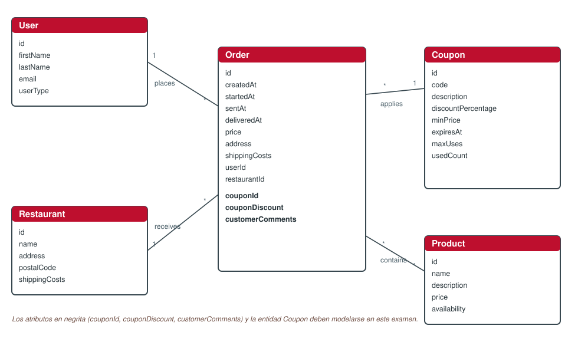

# DeliverUS Exam - Coupon Model - Coupon Management by Customers

## Exam statement

Until now DeliverUS had two user types: **customer** (client, who places orders) and **owner** (restaurant owner, who manages their restaurants and confirms/sends/delivers orders). In this exam the customer application (`DeliverUS-Frontend-Customer`) is extended with **coupon management**.

### What is a coupon and what can a customer do?

A coupon is a discount code that the customer can apply to one of their **pending** orders. Each coupon has a discount percentage, a minimum order price, an expiry date and a maximum number of uses.

In short, a customer can:

1. **Register and login** (`POST /users/register`, `POST /users/login`). *This part is already implemented.*
2. **View available coupons**: those that have not expired and still have uses left. *This part is already implemented.*
3. **Apply a coupon to one of their pending orders**: the order becomes associated with the coupon and its price is reduced by the coupon discount. From that moment the coupon stops being available for that order.
4. **List their orders**, to track the ones not yet delivered and the already delivered ones, and see the coupon applied to each one.
5. **Remove the coupon** from a pending order, restoring its original price and freeing the coupon use.
6. **Add delivery instructions**: a note about how to deliver the order (e.g. "Leave at the door, no answer at the bell").

> ⚠️ **A coupon can only be applied or removed while the order is pending** (that is, before the restaurant confirms it). Confirmed orders cannot change their amount.

### Conceptual model

Reference class diagram of DeliverUS including the `Coupon` entity and its relationship with `Order` (to be modelled by the students).



### Coupon data model

| Field | Type | Description |
| --- | --- | --- |
| `id` | INTEGER | Primary key. |
| `code` | STRING | Unique coupon code (e.g. `WELCOME10`). |
| `description` | STRING | Coupon description. |
| `discountPercentage` | INTEGER | Discount percentage (1-100). |
| `minPrice` | DOUBLE | Minimum order price to be able to apply it. |
| `expiresAt` | DATE | Expiry date and time. |
| `maxUses` | INTEGER | Maximum number of uses. |
| `usedCount` | INTEGER | Number of uses already made. |

Changes to be made on the order (`Order`): `couponId` (foreign key to `Coupon`), `couponDiscount` (discounted amount) and `customerComments` (delivery instructions text).

### The coupon in the order lifecycle

The order lifecycle remains `pending → confirmed (startedAt) → sent (sentAt) → delivered (deliveredAt)`, managed by the owner via `confirm`/`send`/`deliver`. The coupon is applied **only** while `pending` (no `startedAt`) and, when applied, the new order price is computed as:

```
couponDiscount = round(price * discountPercentage / 100, 2)
price = price - couponDiscount
```

When the coupon is removed, the price goes back to its original value (`price + couponDiscount`) and `couponId` and `couponDiscount` are set to `null`.

The following functional requirements must be implemented:

> The acceptance tests for each FR are split into **Backend** (verified with the help of `coupons.test.js`, which must not be modified) and **Frontend** (behavior that must be observed when using the application: navigation after an action and success/error messages).

### **FR1. View available coupons**. **ALREADY IMPLEMENTED**

**As** a customer,

**I want** to see the list of valid coupons that still have uses left

**so that** I can choose which one to apply to my order.

**Acceptance tests — Backend** (`GET /coupons/available`):

- Not logged in: `401 Unauthorized`.
- Logged in as `owner`: `403 Forbidden`.
- Logged in as `customer`: `200 OK` and an array of coupons.
- An expired coupon (`expiresAt` in the past) must not appear in the list.
- A coupon with no uses left (`usedCount` greater than or equal to `maxUses`) must not appear either.

**Acceptance tests — Frontend** (`AvailableCouponsScreen.js`, already implemented, for reference):

- Entering the "Available coupons" tab loads the list automatically.
- If the request fails, an error message is shown and the previous list is kept.

### **FR2. Apply a coupon**

**As** a customer,

**I want** to apply a coupon to one of my pending orders

**so that** I pay less for that order.

**Acceptance tests — Backend** (`PATCH /orders/:orderId/applyCoupon`):

- Not logged in: `401 Unauthorized`.
- Logged in as `owner`: `403 Forbidden`.
- Order that does not belong to the authenticated customer: `403 Forbidden`.
- Nonexistent order: `404 Not Found`.
- Missing or empty `code` in the request body: `422 Unprocessable Entity`.
- Nonexistent coupon: `404 Not Found`.
- Order that is not pending (already has `startedAt`): `409 Conflict`.
- Order that already has a coupon applied: `409 Conflict`.
- Order whose `price` is below the coupon `minPrice`: `409 Conflict`.
- Expired coupon: `409 Conflict`.
- Coupon with no uses left: `409 Conflict`.
- Success: `200 OK`, and the returned order has `couponId` equal to the coupon id, `couponDiscount` equal to the discounted amount, `price` reduced by that amount, and the coupon `usedCount` increased by 1.

**Acceptance tests — Frontend** (`EditOrderScreen`, **Exercise 5**):

- The screen has a form with the coupon code.
- On success: a success message is shown and the displayed order is refreshed, so the new price and the discount become visible.
- If the action fails (invalid code, coupon not applicable, etc.): an error message is shown and the app stays on the screen.

### **FR3. List my orders**

**As** a customer,

**I want** to see the list of orders I have placed

**so that** I can track the ones not yet delivered and the already delivered ones, and easily reach the orders I can act on.

**Acceptance tests — Backend** (`GET /orders/customer`):

- Not logged in: `401 Unauthorized`.
- Logged in as `owner`: `403 Forbidden`.
- Logged in as `customer`: `200 OK` and an array of orders.
- The list must include only orders whose `userId` is the authenticated customer's (never orders of other customers).
- Orders not yet delivered (`deliveredAt` is `null`) must be listed before the delivered ones.

**Acceptance tests — Frontend** ("My Orders" screen, **Exercise 4**):

- Each order is shown with the restaurant logo, the order id, the restaurant name, the delivery address and the price.
- If the order has a coupon applied, its code and/or the applied discount is shown.
- Tapping the `ImageCard` of each order navigates to the `EditOrderScreen`.
- The list reloads when coming back from `EditOrderScreen`, not only the first time the screen is mounted.
- If the customer has no orders, a message stating so is shown instead of an empty list.
- If the request fails, an error message is shown.

### **FR4. Remove a coupon**

**As** a customer,

**I want** to remove the coupon from a pending order

**so that** I stop applying a discount I no longer want to use.

**Acceptance tests — Backend** (`PATCH /orders/:orderId/removeCoupon`):

- Not logged in: `401 Unauthorized`.
- Logged in as `owner`: `403 Forbidden`.
- Order that does not belong to the authenticated customer: `403 Forbidden`.
- Nonexistent order: `404 Not Found`.
- Order that is not pending (already has `startedAt`): `409 Conflict`.
- Order that has no coupon applied: `409 Conflict`.
- Success: `200 OK`, with `couponId` and `couponDiscount` set to `null`, the `price` restored to its original value and the coupon `usedCount` decreased by 1.

**Acceptance tests — Frontend** ("My Orders" screen, **Exercise 4**):

- A pending order with a coupon shows the "Remove coupon" button (colour `brandGreen`).
- On success: a success message is shown and the list is refreshed **on the same screen**; the updated order stops showing the discount and the button.
- If the action fails: an error message is shown and the list is not modified.

### **FR5. Add delivery instructions**

**As** a customer,

**I want** to add or edit a note about the delivery of one of my orders

**so that** I can tell the delivery driver how to deliver it (e.g. where to leave it).

**Acceptance tests — Backend** (`PATCH /orders/:orderId/customerComments`):

- Not logged in: `401 Unauthorized`.
- Logged in as `owner`: `403 Forbidden`.
- Order that does not belong to the authenticated customer: `403 Forbidden`.
- Nonexistent order: `404 Not Found`.
- `customerComments` exceeds 500 characters: `422 Unprocessable Entity`.
- `customerComments` empty, `null` or absent: valid, `200 OK` (the comment is optional).
- Success: `200 OK`, with the returned order reflecting the new `customerComments`.

**Acceptance tests — Frontend** (`EditOrderScreen`, **Exercise 5**):

- This screen is reached by tapping an order card in the "My Orders" list.
- The instructions form is initialised with the order's already saved comment (or empty if it had none).
- If the user types more than 500 characters, the frontend must show a validation error **before** sending the request, and the save button must not complete the submission. In any case, the backend must also ensure the comment does not exceed 500 characters and show the errors sent by the backend.
- On success: a success message is shown and the app navigates back to the "My Orders" list (`MyOrdersScreen`).
- If saving fails (e.g. server or connection error): an error message is shown and the app stays on the form, without losing what was typed.

---

## Backend part

### Exercises (Backend)

#### 1. Migrations and Models (1 point)

Make the necessary changes in migrations and models to implement the association between orders and coupons, and the delivery instructions:

- Add to `Order` the columns `couponId` (foreign key to `Coupons`), `couponDiscount` and `customerComments`.
- Add the association `Order.belongsTo(Coupon)` (with alias `coupon`).

Remember to modify both the `create-order` migration and the `Order.js` model.

#### 2. Routing, Middlewares and Validation (2 points)

In `src/routes/OrderRoutes.js` add the new routes to implement the following functional requirements:

- **FR2. Apply a coupon**
- **FR3. List my orders**
- **FR4. Remove a coupon**
- **FR5. Add delivery instructions**

In `src/middlewares/OrderMiddleware.js`, implement the following new middlewares:

- `checkOrderBelongsToCustomer` to check that the order belongs to the authenticated customer (used in **FR2**, **FR4** and **FR5**).
- `checkOrderCanBeCouponApplied` to fulfil **FR2. Apply a coupon** (pending order, no previous coupon, existing coupon, not expired, with uses left and minimum price reached).
- `checkOrderCanRemoveCoupon` to fulfil **FR4. Remove a coupon** (pending order with a coupon applied).

In `src/controllers/validation/OrderValidation.js`, add the validation rules:

- `applyCoupon` needed for **FR2** (the `code` is required).
- `updateCustomerComments` needed for **FR5**.

> The middlewares `checkOrderVisible`, `checkOrderIsPending`, `checkOrderCanBeSent`, `checkOrderCanBeDelivered` and `checkOrderOwnership`, as well as `handleValidation`, are already implemented and can be used as reference if needed.

> As a route order reference, `PATCH /orders/:orderId/applyCoupon` goes through: `isLoggedIn`, `hasRole('customer')`, `checkEntityExists(Order, 'orderId')`, `checkOrderBelongsToCustomer`, the `applyCoupon` validation rules, `handleValidation`, `checkOrderCanBeCouponApplied` and, finally, the controller.

> Keep in mind that `GET /orders/customer` must be registered **before** `GET /orders/:orderId`, so that Express does not interpret `customer` as an `orderId`.

#### 3. Controllers (2 points)

In `src/controllers/OrderController.js`:

- Implement `applyCoupon` to fulfil **FR2. Apply a coupon**.
- Implement `indexCustomer` to fulfil **FR3. List my orders** (currently returns `500`).
- Implement `removeCoupon` to fulfil **FR4. Remove a coupon**.
- Implement `updateCustomerComments` to fulfil **FR5. Add delivery instructions**.

---

### Provided Code (Backend)

For this exam, the following is already implemented:

1. Customer registration and login (`registerCustomer`/`loginCustomer`, in `UserController.js` and `UserRoutes.js`).
2. The `Coupon` model (`src/models/Coupon.js`), its migration (`create-coupon`) and its seeder, including sample coupons (`WELCOME10`, `SUMMER20`, `LASTONE`).
3. The `findAvailableCoupons` controller and the `GET /coupons/available` route (**FR1. View available coupons**).
4. The check that a customer can view the detail of their own orders (`checkOrderCustomer`, in `OrderMiddleware.js`).
5. The `confirm`, `send`, `deliver` and `show` controllers, which you may reuse if needed.
6. The user seeder already includes a test customer: `customer1@customer.com` / `secret`.

---

## Frontend part (Customer app)

Implement the screens needed in `DeliverUS-Frontend-Customer` so that a customer can use the application.
**NOTE: only what can be used as an end user would use it will be assessed. Screens that do not render or features that cannot be tested from the interface will not be assessed**

### Exercises (Frontend)

#### 4. "My Orders" list screen (2 points)

**Screen**: `src/screens/customerOrders/MyOrdersScreen.js`

Implement this screen to fulfil **FR3. List my orders** and **FR4. Remove a coupon**. Use the `ImageCard` component for each order. You can use `AvailableCouponsScreen.js` as inspiration.

**Backend API needed** (add the missing functions in `src/api/OrderEndpoints.js`):

- `GET /orders/customer`
- `PATCH /orders/:orderId/removeCoupon`

#### 5. Order detail and coupon screen (2 points)

**Screen**: `src/screens/customerOrders/EditOrderScreen.js`

You already have a version of this screen showing a header with restaurant and order data, and the product list. Add two forms with `Formik` and a `yup` validation schema:

- a form to **apply a coupon** (**FR2**) with the coupon code, and
- a form to **add the delivery instructions** (**FR5**),

showing any backend validation errors. Also register this screen in `CustomerOrdersStack.js` so it is reachable from `MyOrdersScreen` by tapping an order.

**Backend API needed** (add the missing functions in `src/api/OrderEndpoints.js`):

- `PATCH /orders/:orderId/applyCoupon`
- `PATCH /orders/:orderId/customerComments`

#### Aesthetic fidelity (1 point)

The degree of visual similarity of the delivered interfaces with the existing screens of the application itself will be assessed.

To that end, also take into account the following:

- Use the corporate colours defined in `src/styles/GlobalStyles.js` (`brandBlue`/`brandBlueTap`, `brandGreen`/`brandGreenTap`, `brandPrimary`) and the `MaterialCommunityIcons` icons (package `@expo/vector-icons`) already used in the rest of the application, keeping a style consistent with the existing screens (`AvailableCouponsScreen.js`, `EditOrderScreen.js`).
- The specific `MaterialCommunityIcons` icons to use are:

| Icon | Where |
| --- | --- |
| `ticket-percent` | "Apply coupon" button (Exercise 5). |
| `map-marker` | Order delivery address, on each order card (Exercise 4) and in the order header (Exercise 5). |
| `cash` | Order price, on each order card (Exercise 4) and in the order header (Exercise 5). |
| `comment-text` | "Save comments" button (Exercise 5). |

### Provided Code (Customer Frontend)

For this exam, the following is already implemented:

1. Customer registration, login and profile (`LoginScreen.js`, `RegisterScreen.js`, `ProfileScreen.js` and their navigation).
2. The available coupons screen (`AvailableCouponsScreen.js`).
3. The existing functions in `src/api/CouponEndpoints.js` (`getAvailableCoupons`) and in `src/api/OrderEndpoints.js` (`getOrderDetail`).
4. The base structure (header with restaurant data and product list) of `EditOrderScreen.js`, to which you only need to add the forms.
5. The `InputItem` component, already prepared to integrate with Formik.

---

## Request/response format

The status codes and business rules of each endpoint are described in the corresponding FR. Here only the shape of the data that is not obvious from the FRs is detailed.

### PATCH /orders/:orderId/applyCoupon (FR2)

**Request**:

```json
{
  "code": "WELCOME10"
}
```

### PATCH /orders/:orderId/customerComments (FR5)

**Request**:

```json
{
  "customerComments": "Left at the door, no answer at the bell"
}
```

---

## Submission procedure

1. Delete the **node_modules** folder of the backend and both frontends.
2. Create a ZIP that includes the whole project. **Important: check that the ZIP is not the same one you downloaded and includes your solution**
3. Tell the teacher before submitting.
4. Once the teacher gives you the go-ahead, you can upload the ZIP to the Virtual Teaching platform. **It is very important to wait until the platform shows you a link to the ZIP before pressing the send button**. It is recommended to download that ZIP to check what has been uploaded. Once the check is done, you can send the exam.

## Environment setup

### a) Windows

- Open a terminal and run the command `npm run install:all:win`.

### b) Linux/macOS

- Open a terminal and run the command `npm run install:all:bash`.

## Running

### 1. Backend

- To **redo the migrations and seeders**, open a terminal and run:

    ```Bash
    npm run migrate:backend
    ```

- To **run it**, open a terminal and run:

    ```Bash
    npm run start:backend
    ```

### 2. Customer Frontend

- With the backend running, open another terminal and run:

    ```Bash
    npm run start:frontend:customer
    ```

- You can log in with the test user `customer1@customer.com` / `secret`, or register a new customer from the application itself.

## Debugging

- To **debug the backend**, make sure there is **NO** running instance, click the `Run and Debug` button in the sidebar, select `Debug Backend` from the dropdown list, and click the *Play* button.

## Test

- As a help you can run the included test suite `coupons.test.js`, which covers customer registration/login, available coupons, applying and removing coupons, listing your own orders and delivery instructions. To do so run:

    ```Bash
    npm run test:backend
    ```

**Warning: the tests cannot be modified.**
